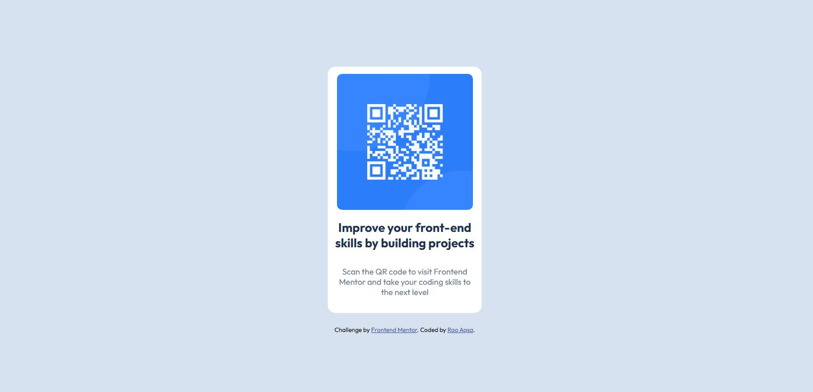

# Frontend Mentor - QR code component solution

This is a solution to the [QR code component challenge on Frontend Mentor](https://www.frontendmentor.io/challenges/qr-code-component-iux_sIO_H). Frontend Mentor challenges help you improve your coding skills by building realistic projects. 

## Table of contents

- [Overview](#overview)
  - [Screenshot](#screenshot)
  - [Links](#links)
  - [Built with](#built-with)
  - [What I learned](#what-i-learned)
- [Author](#author)

## Overview

This was my first Frontend Mentor project where i built a simple QR code component. The goal was to practice HTML, CSS and Responsive design while getting comfortable with GitHub workflow.

### Screenshot




### Links

- Solution URL: [Add solution URL here](https://your-solution-url.com)
- Live Site URL: [Add live site URL here](https://your-live-site-url.com)


### Built with

- Semantic HTML5 markup
- CSS custom properties
- Flexbox
- Mobile-first workflow


### What I learned

This project helped me strengthen my basics. I learned:  

 How to center a card using Flexbox  
```css
body {
  display: flex;
  justify-content: center;
  align-items: center;
  min-height: 100vh;
}

How to import and use Google Fonts
<link href="https://fonts.googleapis.com/css2?family=Outfit:wght@400;700&display=swap" rel="stylesheet">

How to make a layout responsive for both mobile and desktop.

## Author

Frontend Mentor - @Rao-Aqsa
GitHub - Rao-Aqsa

